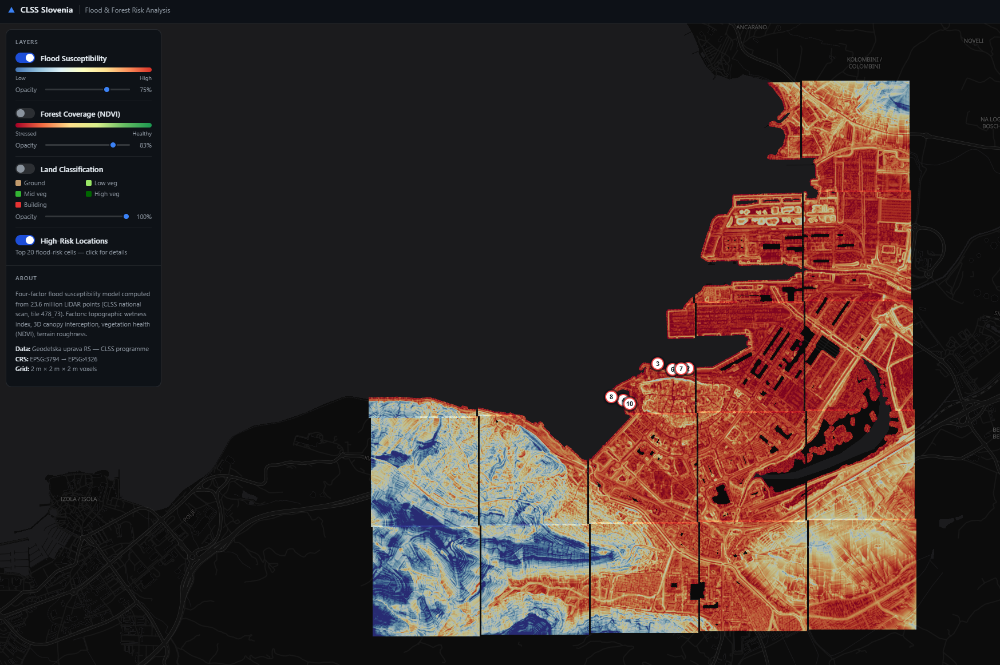
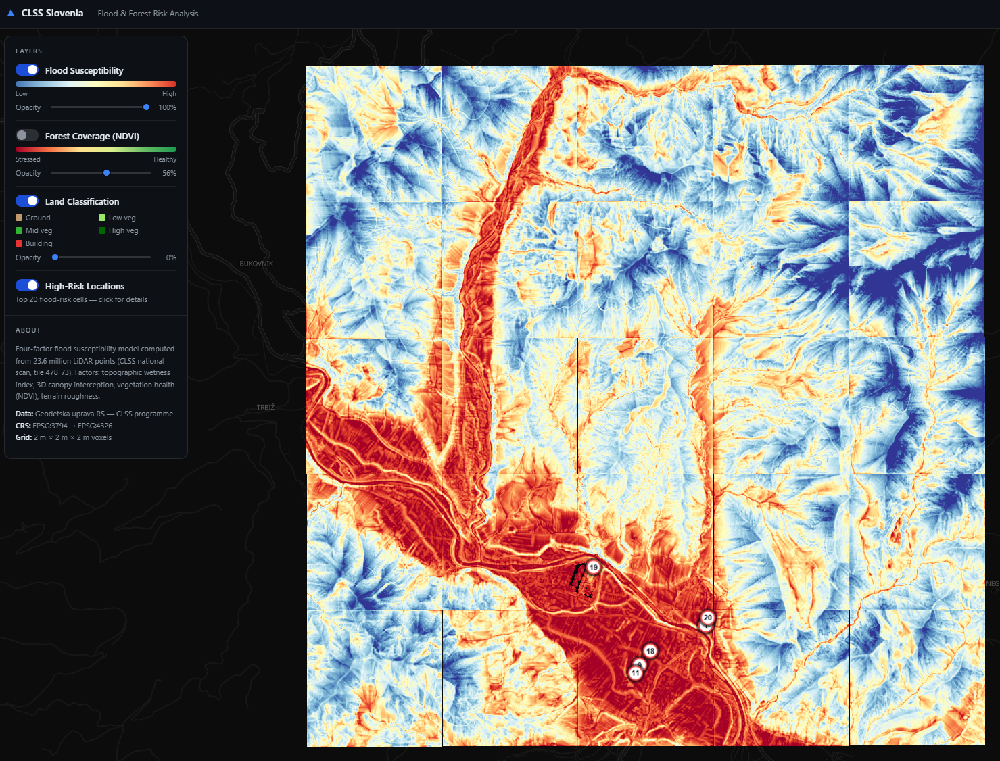
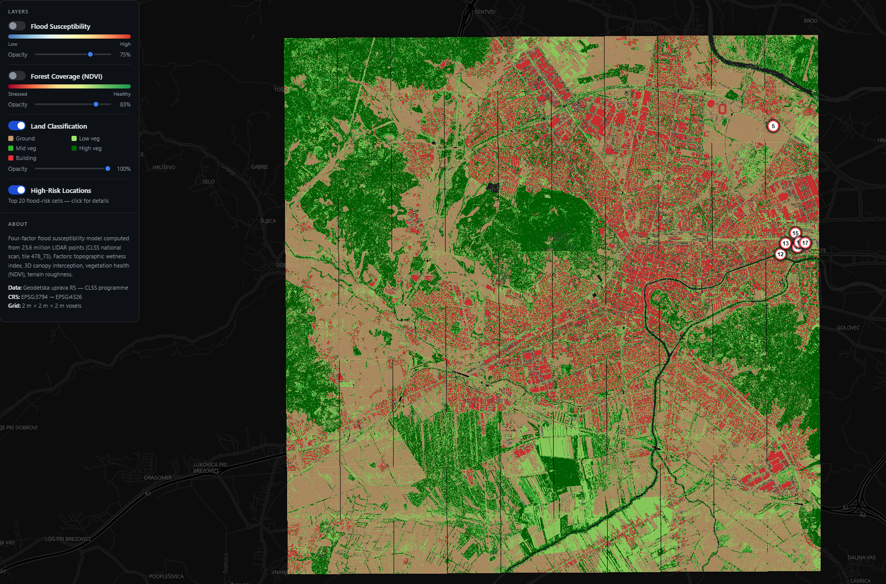
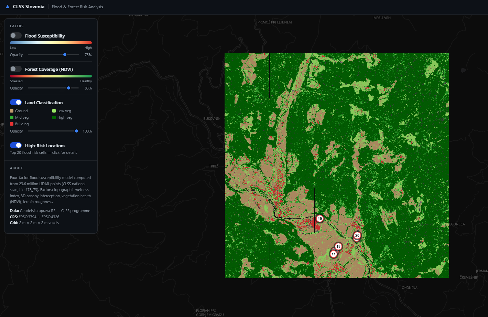
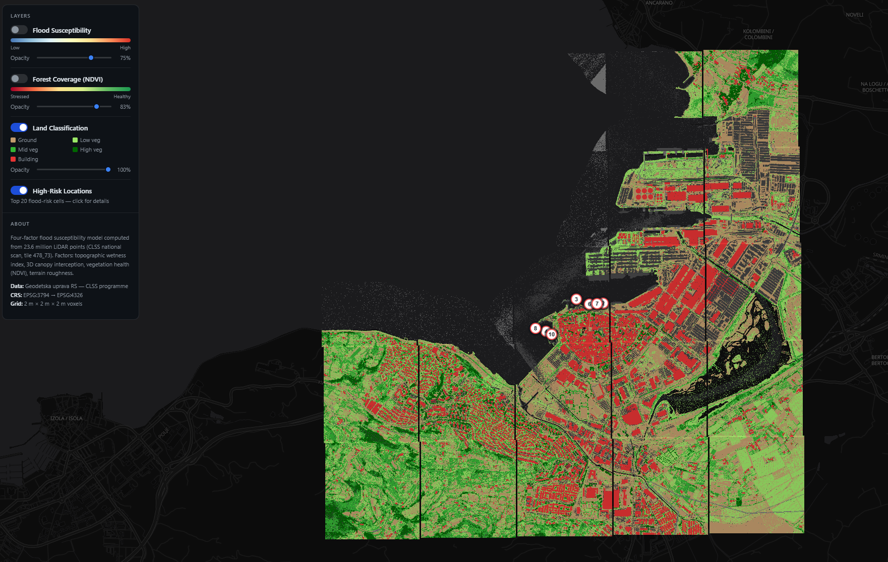
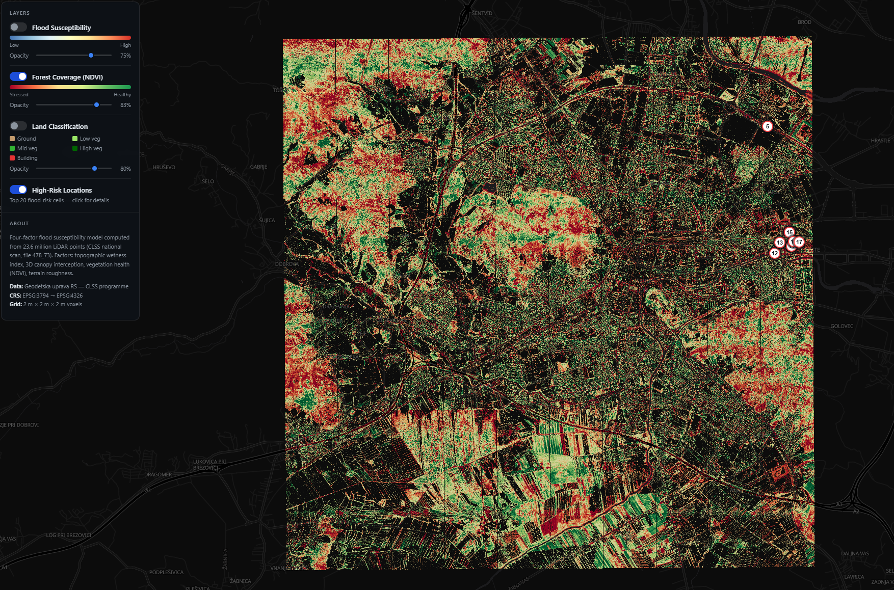
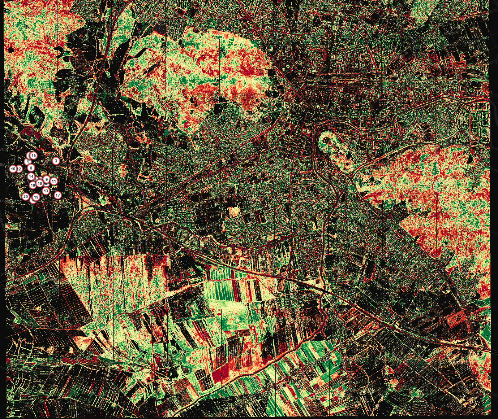
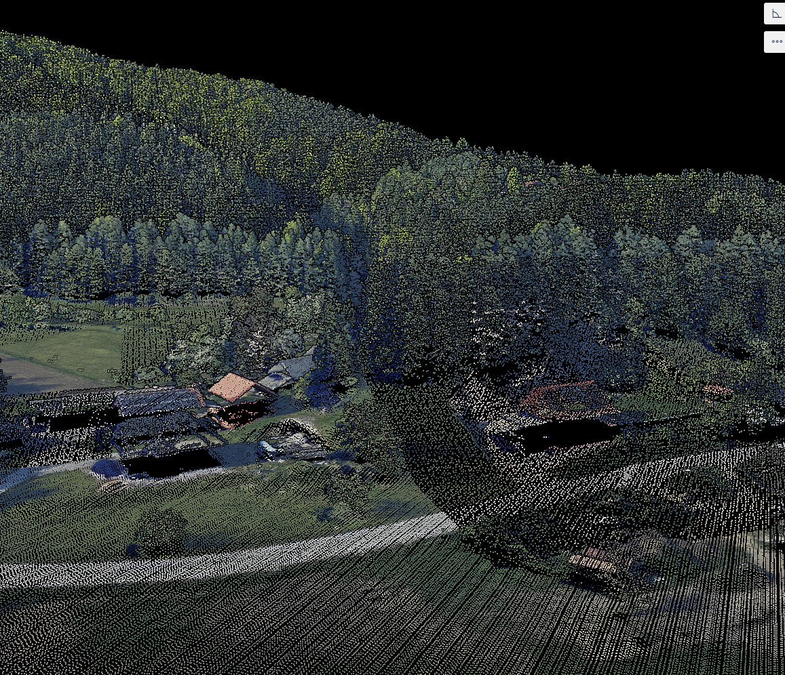

# Slovenia CLSS LiDAR — Flood Susceptibility & Terrain Screening

An interactive web map overlaying riverine flood susceptibility, Koper coastal sea-level-rise exposure, ERA5-Land-style hydroclimate trigger state, and forest-NDVI analysis derived from Slovenia's national airborne LiDAR dataset (CLSS — *Ciklično lasersko skeniranje*) onto a dark basemap styled after the national viewer at [clss.si](https://clss.si).

**Live demo →** https://dhairyamishra.github.io/slovenia-lidar-floodmap/

## Map layers in action

The interface lets you combine derived screening layers and adjust opacity. The experimental D19 baseline and its region-capped review points are off by default. Its normal display is a sparse purple review mask; the original saturated red surface remains available only for technical audit. Neither is probability, modeled depth, or official flood hazard.

### Flood susceptibility

The default D19 view shows only the upper band of its fixed regional display scale in purple. This is an unvalidated display cutoff for sparse review—not a hazard class or area percentile. The original blue-to-red D19 surface is retained as a selectable frozen diagnostic because a Phase-0 audit found that it saturates most valid land with warm/red colors. Numbered points are region-capped review candidates, not a globally comparable probability ranking.

<table>
  <tr>
    <td width="50%"></td>
    <td width="50%"></td>
  </tr>
  <tr>
    <td align="center"><strong>Koper:</strong> the riverine baseline highlights low-lying urban and port terrain. The separate coastal controls add the +0.5 m, +1.0 m, and +2.0 m sea-level-rise screens.</td>
    <td align="center"><strong>Savinja:</strong> the warm corridor follows the alpine valley floor and drainage network, while steep uplands remain predominantly lower-risk blue.</td>
  </tr>
</table>

### Land classification

The classification layer translates CLSS return classes into a compact surface map: ground is tan, buildings are red, and vegetation progresses from light green (low) through medium green to dark green (high). Black or transparent areas contain no classified ground return, including open water and coastal no-data cells.

<table>
  <tr>
    <td width="50%"></td>
    <td width="50%"></td>
  </tr>
  <tr>
    <td align="center"><strong>Ljubljana:</strong> dense red building fabric, tan open ground, agricultural plots, and high-vegetation forest blocks.</td>
    <td align="center"><strong>Savinja:</strong> a forest-dominated alpine landscape surrounding the developed valley floor.</td>
  </tr>
  <tr>
    <td colspan="2"></td>
  </tr>
  <tr>
    <td colspan="2" align="center"><strong>Koper:</strong> port buildings and paved ground stand out from vegetated slopes; the sea remains unclassified.</td>
  </tr>
</table>

### Forest health (NDVI)

The NDVI layer uses the LiDAR sensor's NIR and red channels. Red indicates relatively stressed or sparse vegetation and green indicates healthier vegetation after a per-tile percentile stretch; black areas are non-vegetated or no-data. The opacity control makes it easy to compare the raster against roads, parcels, and the dark basemap.

<table>
  <tr>
    <td width="50%"></td>
    <td width="50%"></td>
  </tr>
  <tr>
    <td align="center">The complete interactive view with the NDVI and high-risk-location controls enabled.</td>
    <td align="center">A closer view showing field-scale and forest-edge variation in vegetation condition.</td>
  </tr>
</table>

### From airborne returns to map layers

<p align="center">
  
</p>

The source is a three-dimensional CLSS LiDAR point cloud: individual returns reconstruct terrain, trees, buildings, and crops. The pipeline groups these returns into a 2 m × 2 m × 2 m voxel grid, derives terrain, hydrology, canopy, vegetation, and classification factors, and exports lightweight georeferenced PNG overlays for the browser map.

## What it shows

| Layer | Description |
|---|---|
| Experimental D19 Terrain Baseline | Frozen unvalidated weighted composite; sparse purple review mask by default and original saturated raster for diagnostics only |
| Official DRSV Hazard Reference | Blue Q10/Q100/Q500 IKPN extent plus hydraulic-study validity and official Q100 depth classes |
| Connected Coastal Low-Land Exposure | Koper-only bathtub screen for +0.5 m / +1.0 m / +2.0 m scenarios; not surge or hydraulic inundation |
| Hydroclimate Trigger | Synthetic Aug-2023 Savinja fixture for UI testing. Real ERA5-Land ingestion remains experimental and must not be presented as evidence yet |
| Terrain Candidates Under Trigger | Existing D19 candidates re-ranked by an uncalibrated synthetic combined index for interface testing |
| Forest NDVI | Per-cell NDVI from 16-bit NIR/R channels — red (stressed) → green (healthy) |
| Land Classification | Ground, low/med/high vegetation, building returns |
| Review Points | Top-20 D19 susceptibility candidates, capped at 7 per CDN region for presentation balance; scores remain non-comparable across regions |

## Dataset

- **146 tiles across 3 CDN regions** — 100 over Ljubljana (`05-ljubljana`, basin), 25 over the Savinja valley (`08-kamnik`, alpine riverine), 21 over Koper (`01-koper`, coastal). Tile coords are EPSG:3794 kilometres (e.g. `460_100` = easting 460 km, northing 100 km).
- Each region is calibrated independently (see below) because their elevation regimes are disjoint.
- Koper includes both the riverine baseline and a separate coastal sea-level-rise overlay. The coastal layer is a first-order screening product, not a hydraulic storm-surge model.
- Source: Flycom CLSS S3 CDN — `https://assets.flycom.si/clss/raw/<region>/zls/gkot/GKOT_E_N.laz`.
- Raw `.laz` tiles (~170–800 MB each — alpine/coastal tiles are denser — ~50 GB total) live in `data/` and are **gitignored**. The small derived overlays in `web/data/` are committed and deployed.

## Run locally

```bash
python -m http.server 8765 --directory web
# open http://localhost:8765
```

## Regenerate analysis

The pipeline reads `GKOT_*.laz` from `data/` and writes all `web/data/` assets.

```bash
# Recommended isolated environment
python -m venv .venv
.venv\Scripts\python -m pip install -r requirements.txt

# 1. Download tiles from the CDN (square grid around a centre, a bbox, or a list)
python download_tiles.py --center 460 100 --radius 4        # 9×9 Ljubljana block

# 2. Calibrate the global normalisation constants — run ONCE per dataset
python pipeline.py --calibrate

# 3. Process every tile → PNGs, manifest, candidates, risk points
python pipeline.py
# or a subset (merges into the existing manifest + global candidates):
python pipeline.py 460_100 461_100

# 4. Write output/diagnostics/model_audit.{json,md}
python analyze_model.py
# CI/release gate: exit nonzero when an available threshold fails
python analyze_model.py --strict

# 5. Acquire official reference layers and evaluate the frozen baseline
python download_validation.py
python prepare_validation_web.py
python evaluate_validation.py

# 6. Build continuous regional hydrology (large outputs stay under ignored output/)
python mosaic_hydrology.py --region savinja --rebuild-dtm
python mosaic_hydrology.py --region ljubljana --rebuild-dtm
# Later runs reuse the cached mosaic DTM:
python mosaic_hydrology.py --region ljubljana
```

Requires: `laspy`, `lazrs`, `numpy`, `scipy`, `pyproj`, `Pillow`, `numba` (the hot DTM/D8/HAND loops in `kernels.py` are Numba-JIT'd). Tiles fan out across processes — `--workers N` overrides the RAM-bound default.

### Regenerate hydroclimate trigger assets

The hydroclimate feature is separate from the LiDAR pipeline. V1 can be generated without external credentials:

```bash
python hydroclimate.py derive-fixture
python hydroclimate.py export
```

This writes `web/data/hydroclimate/manifest.json`, `hydro_2023-08-04.geojson`, and `dynamic_risk_2023-08-04.geojson`. The fixture is designed for UI validation and the Savinja Aug-2023 hindcast narrative; it is not real ERA5-Land evidence.

For real ERA5-Land inputs, place NetCDF files under `data/era5/` (gitignored) with `swvl4`, `tp`, and `smlt` variables, install xarray/NetCDF support, then run:

```bash
python hydroclimate.py derive --date 2023-08-04
python hydroclimate.py export --date 2023-08-04
```

The real-data path computes `hydro_score = soil_moisture_norm + water90_norm + 0.5 * wetting_trend_norm` and `hydro_index = hydro_score / 2.5`, following the Copernicus/BGC ERA5-Land trigger concept.

### Why calibration?

Each susceptibility factor is normalised against a **fixed [p2, p98] range derived per CDN region** (not re-curved per tile) so risk scores are comparable within a region. Regions are calibrated separately because Ljubljana basin, alpine Savinja, and coastal Koper have disjoint elevation regimes — a single ruler is meaningless. `pipeline.py --calibrate` derives all regions (or `--calibrate --region 01-koper` for one, merging into the rest) and stores them in `calibration.json` (`model_version: 2`, a `regions` dict) along with a dataset fingerprint. Normal runs warn if `data/` has changed and a recalibration is due. See [`DECISIONS.md`](DECISIONS.md) D15/D17/D18.

## Pipeline outputs

| Path | Description |
|---|---|
| `web/data/tiles/<name>/susceptibility.png` | Legacy D19 relative-susceptibility overlay (RdYlBu_r; unvalidated baseline) |
| `web/data/tiles/<name>/susceptibility_d19_review.png` | Sparse purple D19 display mask; visual-review cutoff only |
| `web/data/tiles/<name>/coastal_slr_0_5m.png` etc. | Koper-only connected low-land exposure overlays for +0.5 m, +1.0 m, +2.0 m scenarios |
| `web/data/tiles/<name>/ndvi.png` | Forest-health NDVI (RdYlGn, percentile-stretched) |
| `web/data/tiles/<name>/classification.png` | Land-cover classes |
| `web/data/manifest.json` | Tile registry (bounds + file paths) consumed by the web app |
| `web/data/candidates.json` | Top-500 D19 susceptibility review candidates; not global probabilities |
| `web/data/risk_points.geojson` | Top-20 review points (de-duplicated at 50 m, presentation-capped at 7 per region) |
| `web/data/hydroclimate/*.geojson` | Hydroclimate trigger grid and hydro-primed risk points for available dates |
| `calibration.json` | Per-region normalisation constants + dataset fingerprint |
| `output/diagnostics/samples/*.npz` | Ignored deterministic full-grid factor/score samples emitted by the pipeline |
| `output/diagnostics/model_audit.*` | Ignored audit reports from `analyze_model.py` |
| `validation/sources.json` | Versioned official DRSV source/layer inventory and pending event-data requirements |
| `validation/evaluation_contract.json` | Frozen grids, spatial splits, boundary buffers, controls, and selection policy |
| `validation/rasters/*` | Packed versioned 2 m / 10 m / 20 m official label grids with digests |
| `validation/evaluation_manifest.json` | Expanded tile assignments and grid provenance generated from the contract |
| `validation/data/*` | Gitignored official source downloads plus acquisition manifest/checksums |
| `web/data/validation/*` | Compact WGS84 Q10/Q100/Q500, validity, and Q100 depth layers used by the app |
| `output/diagnostics/validation_q100.*` | Gitignored D19/baseline evaluation against official Q100 inside its validity domain |
| `output/mosaic/<region>/manifest.json` | Gitignored reproducibility manifest, digests, seam checks, conditioning/threshold sensitivities, and development-only benchmark |
| `output/mosaic/<region>/tiles/*.npz` | Thirteen continuous mosaic-derived feature grids cut back to web-tile bounds after routing (25 Savinja; 100 Ljubljana) |
| `output/mosaic/<region>/qa_overview.png` | Conditioned terrain, accumulation, HAND, and official/derived-channel QA overview |

## Scripts

| Script | Purpose |
|---|---|
| `pipeline.py` | **Canonical pipeline.** Processes all `GKOT_*.laz` → riverine PNGs, Koper coastal scenario PNGs, manifest, candidates, and risk points. Supports subset runs and `--calibrate`. |
| `analyze_model.py` | Phase-0 audit: display saturation, candidate concentration, full-grid altitude association, factor association, and descriptive ablations. |
| `model_diagnostics.py` | NumPy-only deterministic score-stratified sampling contract shared by pipeline and tests. |
| `download_validation.py` | Downloads/paginates/deduplicates official DRSV layers for three study-region envelopes and records provenance. |
| `prepare_validation_web.py` | Dissolves, simplifies, and transforms official Q10/Q100/Q500 references for MapLibre. |
| `prepare_d19_web.py` | Migrates committed legacy D19 colors into compact sparse review PNGs without rerunning LAZ processing. |
| `evaluate_validation.py` | Labels diagnostic samples inside official IKPN validity and reports D19/HAND/TWI baseline metrics. |
| `prepare_validation_contract.py` | Generates packed multi-resolution label grids and expanded frozen split metadata. |
| `validation_grid.py` | Deterministic rasterization, mask packing, split assignment, and digest helpers. |
| `mosaic_hydrology.py` | Builds continuous Savinja or Ljubljana DTMs, compares conditioning/D8/MFD/threshold sensitivities without locked-test access, exports exact receiver/connectivity/terrain features and tile windows, and records QA/provenance. |
| `hydroclimate.py` | ERA5-Land-style hydroclimate trigger pipeline. Builds fixture assets for V1 and can derive from local ERA5-Land NetCDF files with xarray. |
| `download_tiles.py` | Downloads CLSS GKOT tiles from the CDN with region auto-discovery and a probe cache. `--center/--radius`, `--bbox`, `--tiles`, `--dry-run`, `--pipeline`. |
| `kernels.py` | Numba `@njit(cache=True)` hot loops — DTM grouped-min, D8 accumulation, HAND grid — bit-identical to the original pure-Python loops but ~70–150× faster. |
| `bench_kernels.py` | Correctness + speed gate: asserts the Numba kernels match the originals on a real tile. `python bench_kernels.py [TILE_ID]`. |

<details>
<summary>Legacy / exploratory scripts (early single-tile work, superseded by <code>pipeline.py</code>)</summary>

| Script | Purpose |
|---|---|
| `flood_susceptibility.py` | Original single-tile four-factor model + voxel cube |
| `export_web_assets.py` | Original single-tile web-asset exporter |
| `gkot_ndvi.py` | Per-point NDVI from 16-bit colour |
| `flood_risk.py` | Channel-network logjam/overhang risk |
| `probe_affordances.py` | Probes hidden LiDAR data properties |
| `inspect_data.py` | Profiles data files → `DATA_SAMPLES.md` |

</details>

## Deployment

The `web/` directory is published to GitHub Pages on every push to `main` via `.github/workflows/deploy-pages.yml`. No backend required.

## Project context

- [`CLAUDE.md`](CLAUDE.md) — full technical context (stack, data, pipeline, applied fixes).
- [`DECISIONS.md`](DECISIONS.md) — chronological decision log with rationale and reversal notes.

## Verified Maintenance Notes

Reviewed on 2026-07-09 (verified 146-tile / 3-region dataset, D19 HAND weight model, D20 Koper coastal overlays, and Numba kernels against the code).

This repository is the Git-backed version of the Slovenia LiDAR floodmap work.
It has the canonical multi-tile pipeline (`pipeline.py`), downloader
(`download_tiles.py`), calibration state (`calibration.json`), static web app
(`web/`), and GitHub Pages workflow configuration.

Current top-level implementation files:

| Path | Purpose |
|---|---|
| `pipeline.py` | Main calibrated multi-tile processing pipeline. |
| `kernels.py` | Shared numerical kernels used by the pipeline. |
| `download_tiles.py` | CLSS tile downloader and region probing helper. |
| `bench_kernels.py` | Kernel benchmark script. |
| `web/index.html` | Static app shell. |
| `web/app.js` | MapLibre map, overlays, controls, and risk markers. |
| `web/style.css` | Web app styling. |
| `.github/` | Deployment workflow configuration. |

Raw CLSS source data remains local under `data/` and should stay out of Git.
Derived web assets under `web/data/` are the deployable outputs consumed by the
static app.

## Data credit

Raw LiDAR data: **Geodetska uprava RS** (CLSS programme), distributed under the Open Government Licence of the Republic of Slovenia. Tiles served via the Flycom CLSS CDN.
